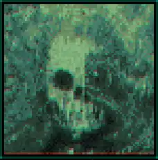

# Imperium of Man — Quasimorph Mod Restoration Fork



This repository is the active community-maintained restoration fork of the discontinued **Imperium of Man** mod for **Quasimorph**. Development is now contained entirely within `mrcalzon02/ImperiumOfMan`; the abandoned upstream repository is retained only as historical attribution and is not the destination for new work.

The runtime package uses the independent Quasimorph identity:

```text
Cvar_ImperiumOfMan
```

The discontinued package used:

```text
andre_ImperiumOfMan
```

The long-term objective is not merely to make the old equipment visible again. The project is intended to restore the Imperium of Man as a complete faction that can exist, expand, trade, produce equipment, control stations, participate in progression, and function as a meaningful force to encounter in the campaign.

## Project status

The repository is currently in **restoration and integration development**.

The source project, asset bundle, package files, and a large collection of new graphics are present. However, the presence of a file in the repository does not mean that the corresponding object is already available in the game. An item becomes functional only after its Unity asset metadata, descriptor, bundle inclusion, C# record registration, localization, balance values, faction availability, and live-game loading behavior have all been verified.

The current package validation workflow checks that the runtime package contains a readable manifest, compiled DLL, Unity asset bundle, and thumbnail. That proves package structure only. Final acceptance still requires launching the current version of Quasimorph, reviewing the game and mod logs, and confirming that every registered object appears and behaves correctly.

### Status terminology

| Status | Meaning |
| --- | --- |
| **Inherited** | Present in the original mod source or original bundle design. It may still require compatibility repair. |
| **Asset imported** | New artwork, audio, or Unity metadata is present, but the corresponding gameplay object may not yet be registered or usable. |
| **Integration planned** | Intended behavior has been inferred and documented, but implementation and balancing remain unfinished. |
| **Source implemented** | The feature exists in source code but has not yet been rebuilt into the packaged DLL and live-tested. |
| **Live verified** | Successfully loaded and tested in the current Quasimorph build. This label will only be used after an actual in-game test. |

## Legacy version conflict protection

The discontinued and maintained packages have different `UniqueModName` values, but that difference alone is not enough to make them compatible. Both codebases still attempt to register many of the same internal faction, station, item, descriptor, localization, and Harmony identifiers. The most important shared faction identifier is:

```text
iom_faction
```

If both packages are allowed to initialize in one Quasimorph session, the result may include:

- two visually identical Imperium factions;
- duplicate or overwritten faction records;
- duplicate station records;
- descriptors pointing to the wrong artwork or sound bank;
- weapons and ammunition referring to records supplied by the other package;
- startup exceptions during `AfterBootstrap`;
- partially registered content;
- campaign saves containing unstable or conflicting faction data.

For that reason, the maintained fork includes a conservative runtime conflict guard in:

```text
src/LegacyConflictGuard.cs
```

### What the guard detects

Before the maintained fork registers its faction or content, the guard searches for evidence of the discontinued package by checking:

1. the current mod content directory;
2. neighboring local mod directories;
3. the local Quasimorph `Mods` directory;
4. the discontinued Workshop item directory associated with Workshop item `3416931502`;
5. the directories of assemblies already loaded into the current Unity/Mono application domain;
6. the active game data immediately before registration to determine whether `iom_faction` already exists.

The manifest detector looks specifically for the discontinued identity:

```text
andre_ImperiumOfMan
```

The final faction-record check protects against cases where a legacy package has already initialized even when its manifest path could not be identified.

### What happens when a conflict is found

When the guard detects the discontinued package or an existing `iom_faction` record, it will:

- write a detailed error to the Quasimorph or Unity log;
- display a full-screen warning inside the game;
- identify the reason and, where possible, the conflicting manifest path;
- cancel this maintained fork's `AfterBootstrap` content registration for that session;
- leave the already loaded game process in the safest available state;
- instruct the player to disable, unsubscribe from, or remove the discontinued package and restart Quasimorph.

The warning contains both an **Acknowledge Warning** button and a **Quit Quasimorph** button. Acknowledging the message only closes the visible warning. It does not enable the maintained fork after registration has been cancelled.

### Why the guard does not automatically unload the old DLL

The guard deliberately does **not** attempt to unload the discontinued assembly. Unity and the Mono runtime do not provide a safe general-purpose way to unload one already loaded mod assembly from the active application domain. By the time a conflict is detected, the old mod may also have applied Harmony patches, created Unity objects, registered descriptors, or written records into global game tables.

Trying to remove only part of that state would be more dangerous than stopping the new fork. It could leave behind a faction without its descriptors, stations without their owner, items without their ammunition, or patches without their controlling assembly.

The safe response is therefore:

```text
Detect conflict
    ↓
Warn the player
    ↓
Cancel Cvar_ImperiumOfMan registration for this session
    ↓
Disable or remove andre_ImperiumOfMan
    ↓
Restart Quasimorph completely
```

### Conservative detection behavior

The guard is intentionally biased toward preventing duplicate registration. If a stale discontinued manifest remains inside a directory that Quasimorph normally scans, the guard may treat it as a conflict even when the player believes the old mod is disabled. In that case, remove, unsubscribe from, or move the stale legacy package outside all Quasimorph mod and Workshop content directories before restarting.

### Current implementation state

The conflict guard is **source implemented** and the project now references Unity's IMGUI module for its on-screen warning overlay. The authoritative root manifest and packaged manifest both use `Cvar_ImperiumOfMan`.

The old Workshop item ID has also been removed from the active build deployment setting. The project will not automatically copy new builds into the discontinued Workshop item's directory. A new Workshop ID must be assigned only after this fork receives its own separate Workshop publication.

The currently committed runtime DLL must still be rebuilt from the updated source before the conflict guard can operate in a live game. The feature becomes **live verified** only after testing all of the following:

- maintained fork only: normal startup proceeds;
- discontinued package only: its historical behavior remains outside this fork's control;
- both packages present: the maintained fork shows the warning and cancels registration;
- warning acknowledged: maintained content remains disabled for the session;
- game restarted after removing the old package: maintained content initializes normally;
- campaign load and save: no duplicate Imperium faction or station records are created.

## What the inherited mod attempted to provide

The original project established the basic framework for an Imperium-themed faction and demonstrated how Quasimorph records could be cloned, visually replaced, and registered as new content. The inherited implementation forms the technical foundation for the restoration fork, but several portions are incomplete, outdated, internally inconsistent, or no longer verified against the current game version.

### Inherited faction framework

The original source attempted to add:

- an Imperium of Man faction record;
- faction equipment rewards and progression references;
- Imperium-controlled or Imperium-associated stations;
- translated faction, station, weapon, and armor names;
- custom equipment using cloned vanilla Quasimorph records;
- a Unity asset bundle loaded during game bootstrap.

The inherited faction is not yet considered fully integrated. Its ability to spawn as an active opposing faction, participate in expansion, control or capture stations, field complete equipment pools, and interact with current campaign systems must be audited and repaired.

### Inherited stations

The source contains station concepts representing major Imperium locations, including records associated with:

- Terra;
- Luna or the Moon;
- Phobos;
- an additional Imperium station whose internal and translated names are inconsistent in the inherited files.

These stations were created by cloning an existing vanilla station descriptor, but their economic definitions are incomplete. In particular, inherited barter records contain little or no meaningful production and consumption data. Some station identifiers and localization keys also do not match one another. As a result, these records require more than a visual repair: they need complete campaign, ownership, trade, production, security, progression, and faction integration.

### Inherited weapons and equipment

The original mod source includes or attempts to include several pieces of Imperium equipment, such as:

- Bolter;
- Lasgun;
- Las-sniper or long-las style weapon;
- Plasma weaponry;
- Melta weaponry;
- Imperium armor pieces and equipment sets.

The inherited implementation generally follows the same pattern: clone an existing Quasimorph item and descriptor, replace its icon, floor sprite, shadow, sounds, and selected statistics, then register the resulting record under a new internal identifier.

This approach remains usable, but every inherited donor record, descriptor name, sound reference, item identifier, localization key, and mutable data list must be checked against the current game assemblies. Old records cannot be assumed to remain valid merely because they compiled in an earlier game version.

## What has changed in this restoration fork

This fork is being separated from the abandoned release both technically and operationally.

Completed repository-level changes include:

- development consolidated in the maintained fork rather than the abandoned upstream;
- active work directed to the single `main` branch;
- authoritative and packaged runtime identities changed from `andre_ImperiumOfMan` to `Cvar_ImperiumOfMan`;
- a source-level legacy conflict detector and on-screen safety warning added;
- maintained-fork registration configured to fail closed when the legacy package is detected;
- automatic deployment to the discontinued Workshop item disabled;
- duplicate or conflicting Unity metadata investigated and repaired for newly imported assets;
- copied Bolter descriptors and sound-bank metadata separated so new weapons can receive independent identities;
- asset-inclusion documentation and validation tools added;
- a local-test package directory established;
- a GitHub Actions package validation and artifact workflow added;
- Games Workshop fan-work and intellectual-property disclaimers added to the license;
- new item graphics, audio, and supporting Unity files imported for future gameplay registration.

These repairs prepare the project for testing, but they do not by themselves make every new item visible. The bundle must be rebuilt from valid Unity imports, and the DLL must register each gameplay record that should use those assets.

## Newly added content and intended functionality

The following evaluation is based on the names, graphics, audio, and apparent role of the newly imported assets. These descriptions are design targets, not claims that every item already works in game. Exact values will be determined through live testing and balance passes.

### Food and consumables

| Added content | Current state | Intended role |
| --- | --- | --- |
| **Corpse Starch** | Asset imported; gameplay registration planned | A compact Imperium ration that restores starvation or hunger and serves as a common military or station-produced food item. It should be practical, inexpensive, and thematically grim rather than medically powerful. |
| **Dirty Corpse Starch** | Asset imported; gameplay registration planned | A contaminated or poorly manufactured ration. It should provide less reliable nutrition and may inflict pain, sickness, poison, infection risk, or another adverse status effect. |
| **Purity Seal** | Asset imported; final gameplay category undecided | Intended as a rare symbolic and administrative resource. Possible roles include a faction progression token, research component, barter item, morale or pain-management consumable, or limited resistance buff. Its final use must fit Quasimorph systems without becoming a universal cure. |

### Currency and faction resources

| Added content | Current state | Intended role |
| --- | --- | --- |
| **Imperial currency or document** | Asset imported; economic registration planned | A faction-specific trade, contract, requisition, or station-economy resource. It should support Imperium barter and production loops rather than functioning as ammunition. |

The economic role of Imperial currency, documents, seals, and requisition items will be coordinated with station production and research so they form a usable progression loop rather than disconnected collectibles.

### Ammunition and power cells

| Added content | Current state | Intended role |
| --- | --- | --- |
| **Las Clip** | Asset imported; registration planned | Rechargeable or replaceable energy ammunition for Las weapons. Expected to inherit beam or battery behavior and receive faction-appropriate stack, range, and damage modifiers. |
| **Bolt Clip** | Asset imported; registration planned | Standard heavy Bolter ammunition serving as the baseline for Bolt weapons. Expected to emphasize high impact and armor penetration. |
| **Kraken Bolt Clip** | Asset imported; registration planned | Armor-piercing Bolt ammunition with stronger penetration, range, or armor effectiveness than the standard clip. |
| **Inferno Bolt Clip** | Asset imported; registration planned | Incendiary Bolt ammunition intended to add fire damage, ignition, or burning status effects. |
| **Hellfire Bolt Clip** | Asset imported; registration planned | Toxic or biological Bolt ammunition intended to add poison, toxin, or persistent biological damage. |
| **Metal Storm Bolt Clip** | Asset imported; registration planned | Fragmenting Bolt ammunition intended for crowd control, additional projectile casts, scatter, or laceration-style area damage. |
| **Tempest Bolt Clip** | Asset imported; registration planned | Energy-enhanced Bolt ammunition intended to add beam-like or electromagnetic effects. |
| **Helfrost Bolt Clip** | Asset imported; registration planned | Cryogenic Bolt ammunition intended to add cold damage and potentially movement or action penalties. |
| **Antiphasic Bolt Clip** | Asset imported; registration planned | Shock or anti-energy ammunition intended to add electrical damage and specialize against protected or unusual targets. |

Specialty Bolt ammunition will be balanced as distinct tactical choices. It should not simply increase every statistic above the standard clip. Each variant should gain a clear advantage while paying for it through rarity, production cost, stack size, accuracy, range, damage distribution, or situational limitations.

### Grenades

| Added content | Current state | Intended role |
| --- | --- | --- |
| **Frag Grenade** | Graphics and audio imported; registration planned | Conventional anti-personnel fragmentation grenade with a broad damage radius and moderate effectiveness against groups. |
| **Krak Grenade** | Graphics and audio imported; registration planned | Focused anti-armor explosive with a smaller effective radius and much stronger single-target or armored-target performance. |
| **Melta Grenade** | Graphics and audio imported; registration planned | Rare close-range anti-armor grenade using intense heat, beam, plasma, or fire behavior. It should be powerful but expensive and dangerous to use at short range. |

### Melee weapons

| Added content | Current state | Intended role |
| --- | --- | --- |
| **Power Fist** | Asset imported; registration planned | Heavy powered melee weapon based on Quasimorph fist behavior. Intended to deliver exceptional blunt or crushing damage with significant weight, action-cost, accuracy, or speed tradeoffs. |
| **Power Blade** | Asset imported; registration planned | High-grade powered sword or blade emphasizing armor penetration and cutting damage. It should be rarer and more effective than ordinary melee weapons without invalidating all alternatives. |

### Firearms

| Added content | Current state | Intended role |
| --- | --- | --- |
| **Bolt Pistol** | Independent artwork, descriptor work, and sound-bank repair underway | Compact heavy sidearm using Bolt ammunition. Intended to provide high impact in a pistol format while being limited by recoil, capacity, rarity, or ammunition weight. |
| **Bolt Rifle** | Independent artwork, descriptor work, and sound-bank repair underway | Full-sized Bolt weapon. Its final relationship with the inherited Bolter must be resolved so the project does not contain two redundant weapons with different names but identical behavior. |
| **Judgement** | Asset imported; exact class under review | The artwork suggests a broad-bodied heavy firearm, shotgun, or hand-cannon style weapon. It will not be assigned statistics until its intended identity is confirmed. Possible roles include a specialist shotgun, execution weapon, or unique named firearm. |

## Development goals

### Core objective: restore the Imperium as a faction to face

The Imperium should eventually operate as more than a collection of player-usable equipment. The intended end state is a fully integrated campaign faction with recognizable strengths, weaknesses, territories, stations, equipment tiers, rewards, production chains, and hostile or diplomatic interactions.

That work includes:

- repairing the faction record for the current Quasimorph API and data layout;
- confirming that the faction can appear, expand, and be encountered normally;
- defining faction equipment pools by technology or progression level;
- assigning Imperium weapons, armor, ammunition, consumables, and resources to appropriate drops and rewards;
- restoring faction questline, expansion, station-control, and capture behavior where supported by the current game;
- preventing duplicate identifiers and conflicts with the discontinued Workshop version;
- ensuring that faction behavior survives save, load, campaign progression, and game updates.

### Station restoration and economic integration

Every Imperium station must receive a complete and internally consistent definition. Planned work includes:

- correcting station identifiers and localization mismatches;
- confirming names, planetary or orbital locations, ownership, and map placement;
- adding meaningful production and consumption statistics;
- defining station barter inventories and economic demand;
- assigning appropriate military, industrial, administrative, and research roles;
- integrating station rewards, mission generation, security, faction reputation, and progression;
- determining whether stations can be captured, lost, rebuilt, or expanded under current campaign systems;
- ensuring that produced equipment corresponds to the station's purpose and available technology.

The goal is for Terra, Luna, Phobos, and other Imperium holdings to feel economically and strategically distinct rather than existing as empty reskins of a vanilla station.

### Production and research

The inherited mod does not currently provide a complete research or manufacturing progression. Planned development includes:

- discovering the current game records responsible for research, data disks, chips, unlocks, production, and faction technology;
- adding valid production recipes or station output for ammunition, food, weapons, armor, grenades, and faction resources;
- creating an intelligible progression from Las equipment through Bolt, Plasma, Melta, and powered melee technology;
- using Imperial documents, requisition resources, purity seals, or comparable items where they improve progression rather than add unnecessary clutter;
- making high-grade ammunition and equipment expensive, rare, or station-dependent enough to preserve campaign balance;
- validating unlocks in a disposable test save before exposing them to long-running campaigns.

### Quality-of-life and reliability work

Planned quality-of-life development includes:

- clear startup logging for every loaded bundle, descriptor, item, station, and faction record;
- fail-fast warnings for missing bundle assets, missing donor records, duplicate IDs, and localization gaps;
- automatic detection of the discontinued `andre_ImperiumOfMan` package;
- an on-screen warning and safe registration shutdown when a legacy conflict is detected;
- a runtime diagnostic dump for current item, descriptor, faction, station, and research tables;
- safer helper methods for cloning and registering records;
- configurable debug logging so ordinary players are not flooded with diagnostic output;
- compatibility notes for game versions and known conflicting mods;
- clean local-test packaging and repeatable validation through GitHub Actions;
- documented installation, testing, save-backup, and bug-reporting procedures;
- balance passes based on actual campaign play rather than values inferred only from source code.

## Gated development plan

Development will proceed through explicit gates. A later phase should not be declared complete while an earlier dependency remains unverified.

### Gate 1 — Package identity and repository recovery

**Status: substantially complete; live conflict test pending**

- maintain work in this fork on `main`;
- use the independent `Cvar_ImperiumOfMan` runtime identity in both source and packaged manifests;
- preserve licensing, attribution, and fan-work disclaimers;
- prevent builds from deploying into the discontinued Workshop item;
- detect the discontinued package before maintained-fork content registration;
- show an on-screen warning and fail closed when a conflict exists;
- maintain a clean runtime package separate from the Unity source project;
- validate required package files automatically;
- rebuild the DLL and complete the legacy-conflict live test matrix.

### Gate 2 — Unity asset inclusion

**Status: active**

- repair duplicate and copied Unity GUIDs;
- generate valid metadata for all imported sprites, audio, descriptors, and folders;
- ensure every new asset has a unique name and intended render identifier;
- rebuild `imperiumofman.bundle`;
- log and verify the bundle's complete asset list;
- confirm that no descriptor silently points back to the inherited Bolter artwork or sound bank.

### Gate 3 — Minimal live vertical slice

**Status: planned**

Register and test a very small representative set before implementing everything:

1. one ammunition item, beginning with the Las Clip;
2. one melee weapon, beginning with the Power Fist;
3. one consumable, beginning with Corpse Starch;
4. one firearm using independent artwork and audio, beginning with the Bolt Pistol.

This gate passes only when all four objects load, display correctly in inventory and on the floor, use the correct sounds and statistics, survive save and load, and produce no startup errors.

### Gate 4 — Complete new item registration

**Status: planned**

- register every added food, resource, ammunition, grenade, melee weapon, and firearm;
- add names, descriptions, short descriptions, and localization keys;
- establish initial statistics and rarity;
- connect compatible weapons and ammunition;
- add faction drops, rewards, vendors, and station availability;
- test each item individually and as part of an equipment ecosystem.

### Gate 5 — Inherited content compatibility restoration

**Status: planned**

- audit every original weapon, armor piece, descriptor, sound bank, and localization key;
- update obsolete donor-record references;
- remove duplicate or broken internal IDs;
- verify the inherited Bolter, Lasgun, Plasma, Melta, long-range weapons, and armor in the current game;
- document anything intentionally removed, renamed, or replaced.

### Gate 6 — Faction and station integration

**Status: planned**

- restore the Imperium as a functioning campaign faction;
- update faction equipment tiers and rewards;
- repair station records and localization;
- add production, consumption, barter, and strategic statistics;
- integrate expansion, ownership, capture, missions, reputation, and other supported campaign behavior;
- confirm that the faction is a meaningful force to face rather than a static entry in the data tables.

### Gate 7 — Production, research, and progression

**Status: planned and dependent on current-game API discovery**

- inspect current Quasimorph assemblies and live records;
- clone complete working vanilla examples before making targeted changes;
- add recipes, unlocks, research resources, and faction technology progression;
- verify progression in a disposable campaign;
- balance production costs, rarity, and station specialization.

### Gate 8 — Quality assurance and release preparation

**Status: planned**

- perform clean-install tests with no discontinued Workshop copy enabled;
- perform a deliberate dual-install test and verify that the conflict guard stops maintained-fork registration;
- review startup and gameplay logs;
- test new and existing saves separately;
- verify station ownership and faction behavior across multiple campaign turns;
- test item drops, vendors, rewards, production, research, save, and load;
- publish a known-issues list;
- convert the thumbnail to a genuine PNG if required by Quasimorph or Steam;
- publish to Steam Workshop only after the local package passes live acceptance testing.

## Local testing

The repository contains a staged runtime package under:

```text
package/ImperiumOfMan
```

A local test copy should contain the manifest, compiled DLL, rebuilt asset bundle, and thumbnail directly inside one mod folder. It can be installed without first publishing to Steam Workshop.

Example destination:

```text
C:\Program Files (x86)\Steam\steamapps\common\Quasimorph\Mods\ImperiumOfMan
```

Do not copy the entire Unity or GitHub project into the Quasimorph `Mods` directory. Only the built runtime package belongs there.

### Required legacy-conflict test

Before ordinary gameplay testing, perform these controlled tests with a disposable save:

1. Install only `Cvar_ImperiumOfMan`, start Quasimorph, and confirm that no legacy warning appears.
2. Close Quasimorph completely.
3. Place or enable the discontinued `andre_ImperiumOfMan` package alongside the maintained fork.
4. Restart Quasimorph and confirm that the full-screen conflict warning appears.
5. Confirm in the log that `Cvar_ImperiumOfMan` cancelled its own content registration.
6. Acknowledge the warning and verify that maintained-fork content did not initialize afterward.
7. Close Quasimorph completely.
8. Disable, unsubscribe from, or remove the discontinued package.
9. Restart and verify that the maintained fork initializes normally.
10. Confirm that only one Imperium faction exists and that no duplicate station records were created.

Do not continue a valuable campaign after a dual-install test. The conflict guard is intended to prevent new duplicate registration, but the discontinued package remains outside the maintained fork's control.

Always back up campaign saves before testing faction, station, research, or progression changes.

## Development policy

- The maintained fork is `mrcalzon02/ImperiumOfMan`.
- Active development uses one branch: `main`.
- New work is not pushed to the abandoned upstream repository.
- The maintained fork must never deploy into the discontinued Workshop item.
- The maintained fork must fail closed when the discontinued package or an existing `iom_faction` record is detected.
- Assets are not considered implemented until their runtime records and live behavior are verified.
- Donor records and game APIs are treated as version-sensitive and must be checked against the currently installed Quasimorph assemblies.
- Changes affecting faction, station, research, or economy data must be tested with disposable saves before release.

## Attribution and source history

The restoration fork preserves the original project's technical and artistic credits. Original 3D model references include:

- [Bolter model](https://sketchfab.com/3d-models/bolter-warhammer-40k-06ae9a4bfef34295aabca8b4c4f1493f)
- [Kaestral Lasgun model](https://sketchfab.com/3d-models/kaestral-lasgun-wh40k-inspired-9058cbf8573e4eea9efe5b15a3575643)

See [`LICENSE.md`](LICENSE.md) for the software license and the Games Workshop fan-work and intellectual-property disclaimer.

## Contributions and testing reports

Contributions should be based on the current `main` branch and should clearly state whether a change affects raw assets, Unity metadata, bundle contents, C# registration, localization, statistics, faction integration, stations, production, research, compatibility protection, or packaging.

A useful bug report should include:

- the current Quasimorph version;
- the fork commit or package artifact tested;
- whether the discontinued Workshop version was installed, enabled, disabled, or removed;
- whether the conflict warning appeared;
- the complete relevant game or BepInEx log section;
- the save type used for testing;
- the exact item, station, faction, or action that failed;
- whether the problem occurs on a new campaign, an existing campaign, or both.

The project will move forward by proving one integration layer at a time: package identity, conflict protection, bundle, descriptor, item record, faction access, station economy, progression, and finally full campaign behavior.
